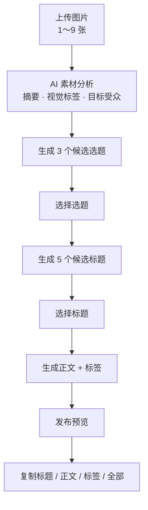
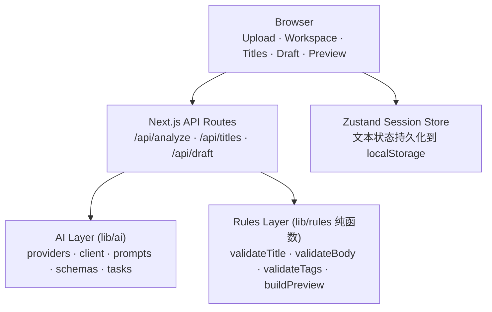

# 抖图 AI

面向抖音图文创作者的 AI 发布助手：上传图片即可完成素材分析、选题、标题、正文与标签生成，并提供发布预览与一键复制。

抖图 AI 是一个面向抖音图文创作者的 AI 内容发布助手。用户上传 1～9 张图片后，系统会依次完成素材理解、选题生成、标题生成、正文与标签生成，并在发布前提供内容预览与复制能力。

> 这是一个 **V0.1 MVP / 作品集项目**。完整链路已经跑通，但仍属于单机自用级别的实现：没有账号体系、没有数据库、不做自动发布（详见 [当前限制](#10-当前限制)）。

---

## 1. 产品流程



**当前 V0.1 的硬规则：**

| 项目 | 规则 |
| --- | --- |
| 图片 | 1～9 张 |
| 标题 | ≤ 20 字 |
| 标签 | ≤ 5 个 |
| 正文 | 20～1200 字 |

这些规则集中定义在 `lib/rules/constants.ts`，由规则层统一判定，AI 只负责生成候选内容。

---

## 2. 核心功能

### 图片上传

- 支持 JPG / PNG / WebP
- 1～9 张
- 浏览器端压缩（长边 ≤ 1280px，输出 JPEG，质量 0.75）
- 压缩后单张上限 2MB、单次请求总量上限 4MB，服务端会重新校验格式、数量与体积
- 图片只保存在浏览器内存中（Blob / ObjectURL）
- 不写入 localStorage

### AI 素材分析

- 图片视觉分析（视觉模型）
- 素材摘要
- 视觉标签
- 目标受众
- 生成 3 个候选选题
- 生成内容 Brief（供后续标题、正文步骤复用）

### AI 标题生成

- 一次生成 5 个候选标题
- 标题 ≤ 20 字校验
- 超长标题不会自动截断，会保留原始字数并标记为不合格
- 无效标题在界面上不可选择

### AI 正文与标签

- 根据素材分析、已选选题和已选标题生成正文
- 正文 20～1200 字
- 标签最多 5 个
- 标签自动规范化（统一 `#` 前缀、全角转半角）与去重，超出数量上限时按现有顺序保留前 5 个
- 若标签被规范化、去重或裁剪，界面会说明被移除 / 合并的具体内容
- 正文与标签由**同一次**模型调用产出

### 发布预览

- 按原始图片比例展示（4:3、3:4、1:1、16:9 等均按原图比例渲染，不做裁切）
- 支持多图轮播，显示「第 X 张 / 共 Y 张」；单图时不显示轮播控件
- 标题、正文、标签统一预览，内容全部来自当前有效状态
- 支持单独复制标题 / 正文 / 标签
- 支持一键复制全部（标题 + 空行 + 正文 + 空行 + 标签）

---

## 3. 为什么这样设计

### AI 与规则分离

**AI 负责：**

- 理解素材
- 生成内容候选（选题、标题、正文、标签）

**规则层负责：**

- 标题字数
- 正文长度
- 标签数量与规范化
- 发布前数据校验

规则以纯函数实现，阈值集中在 `lib/rules/constants.ts`，AI 返回的内容一律先经过规则层判定才会进入最终结果。这样可以避免「模型说合格就合格」，也让字数口径、标签规范这类确定性逻辑只有一份实现。

### 状态失效机制

当上游输入发生变化时，下游已生成的结果会被清除，避免用户看到与当前素材/选题不匹配的旧结果：

| 上游变化 | 清除内容 |
| --- | --- |
| 重新上传 / 删除图片 | 素材分析、选题、标题、正文与预览 |
| 重新分析素材 | 旧选题、标题、正文与预览 |
| 切换选题 | 标题、正文与预览 |
| 重新生成标题 | 已选标题、正文与预览 |
| 选择新标题 | 旧正文与预览 |
| 重新生成正文 | 更新正文、标签与预览 |

### 控制 AI 调用成本

当前 V0.1 的成本控制方式：

- 一次用户操作对应一次模型调用
- 不做自动重试（SDK `maxRetries = 0`）
- 不做后台轮询
- 标题一次生成 5 个候选
- 正文与标签一次生成

也就是说，完整跑一遍「分析 → 标题 → 正文」固定是 3 次模型调用，用户不点击就不会产生调用。

---

## 4. 技术栈

| 技术 | 版本 |
| --- | --- |
| Next.js | 16.3.5（App Router + Turbopack） |
| React | 19.2.8 |
| TypeScript | ^5 |
| Tailwind CSS | ^4 |
| shadcn/ui | ^4.21.0 |
| Radix UI | ^1.6.7 |
| Zustand | ^5.0.15 |
| Zod | ^4.6.5 |
| OpenAI-compatible SDK（`openai`） | ^7.18.0 |
| Vitest | ^4.1.11 |
| Node.js | >= 20.9.0 |

---

## 5. 项目架构



主要目录：

```text
app/
  api/
    analyze/      # 图片视觉分析 + 选题 + brief
    titles/       # 标题生成
    draft/        # 正文 + 标签生成

components/
  upload/         # 上传、压缩、缩略图、开始分析
  analysis/       # 素材分析结果
  topics/         # 选题选择
  titles/         # 标题生成与选择
  draft/          # 正文与标签生成与展示
  preview/        # 发布预览、图片轮播、复制按钮

lib/
  ai/             # 模型调用层：providers / client / prompts / schemas / tasks
  rules/          # 规则层：纯函数，无网络、无 AI、无 React
  image/          # 客户端压缩与图片内存登记表
  store/          # Zustand 会话状态与状态失效矩阵
  preview/        # 预览数据派生、轮播索引、复制逻辑
  errors/         # 统一错误码 / 用户文案 / AppError
  types/          # 会话、内容与 API 契约类型
```

**职责边界：**

- **AI 层**负责模型调用和结构化输出（Prompt、Zod schema、单次调用、错误分类）。
- **Rules 层**负责确定性的业务规则校验，三个 AI 路由都只调用规则层，不重复实现规则。

三个 API 路由统一返回 `{ ok: true, data }` 或 `{ ok: false, error }`，响应均带 `Cache-Control: no-store`。

---

## 6. AI 模型配置

项目通过 **OpenAI-compatible API** 调用模型，服务端环境变量如下：

| 变量 | 说明 | `.env.example` 中的示例值 |
| --- | --- | --- |
| `AI_PROVIDER` | 供应商标识，仅用于 `/api/health` 展示 | `dashscope` |
| `AI_API_KEY` | 模型密钥，仅服务端读取 | 留空，需自行填写 |
| `AI_BASE_URL` | OpenAI-compatible API 地址 | `https://dashscope.aliyuncs.com/compatible-mode/v1` |
| `AI_VISION_MODEL` | 视觉模型，用于 `/api/analyze` | `qwen-vl-max` |
| `AI_TEXT_MODEL` | 文本模型，用于 `/api/titles` 与 `/api/draft` | `qwen-plus` |

说明：

- 只需要修改 `AI_BASE_URL` 与模型名称，就能切换到其他 OpenAI-compatible 服务。
- 本项目在本地验证过 DeepSeek 配置（`AI_BASE_URL=https://api.deepseek.com`，视觉与文本模型均使用 `deepseek-flash`），同时保留 DashScope 的默认配置作为 `.env.example` 示例。
- 密钥只通过服务端环境变量读取，不使用 `NEXT_PUBLIC_` 前缀，也不会出现在接口响应或错误信息中。

---

## 7. 本地运行

环境要求：**Node.js >= 20.9.0**

```bash
# 1. 安装依赖
npm install

# 2. 配置环境变量（复制模板后填写密钥）
# macOS / Linux
cp .env.example .env.local
# Windows
copy .env.example .env.local

# 3. 启动开发服务器
npm run dev
```

启动后访问 http://localhost:3000

需要在 `.env.local` 中配置的变量：

```text
AI_API_KEY
AI_BASE_URL
AI_VISION_MODEL
AI_TEXT_MODEL
```

工程检查命令：

```bash
npm run lint        # ESLint
npm run typecheck   # tsc --noEmit
npm run test        # Vitest
npm run build       # Next.js 生产构建
```

---

## 8. 测试

V0.1 当前测试结果：**17 test files / 314 tests passed**（未统计覆盖率）。

测试覆盖范围：

- `tests/rules`：字数口径、标题 / 正文 / 标签校验、复制文本构建
- `tests/ai`：请求体与模型输出的 Zod schema 校验
- `tests/api`：三个 API 路由的成功路径、错误分类与成本保护（一次点击一次调用、不自动重试）
- `tests/store`：Zustand 会话状态与状态失效矩阵
- `tests/preview`：预览数据派生、轮播索引、四种复制内容与成功/失败反馈
- `tests/image`：图片压缩参数与上传数量文案

---

## 9. 数据与隐私

当前 V0.1 的实际行为：

- 没有数据库，服务端无状态
- 上传的图片不持久化到服务器，只在请求期间于内存中转换为 base64 转发给视觉模型
- 图片主要保存在浏览器内存中的 Blob / ObjectURL
- 图片不写入 localStorage
- 文本类结果（素材分析、选题、标题、正文与标签）会写入浏览器 localStorage，便于刷新后继续
- AI API Key 仅通过服务端环境变量使用，不使用 `NEXT_PUBLIC_` 前缀
- 接口响应与错误信息中不包含密钥、Prompt 原文或图片内容

---

## 10. 当前限制

V0.1 是 MVP，以下能力**尚未实现**：

- 无用户登录与账号体系
- 无历史记录
- 无数据库
- 无自动发布（不会代发抖音）
- 无多平台发布
- 无发布后的数据分析
- 无自动 AI 优化建议
- 无正文编辑器（正文由 AI 生成，当前仅支持重新生成）
- 图片只存在浏览器内存中，**刷新页面会导致图片素材丢失**（文本类结果会保留）
- 公开发布前需要考虑 API 调用额度保护、访问控制或限流

---

## 11. 产品截图

<!-- TODO: 添加 V0.1 完整链路截图 -->

---

## 12. V0.1 状态

**当前版本：** V0.1

**状态：** 已封版

V0.1 已完成链路：

```text
上传 → 分析 → 选题 → 标题 → 正文与标签 → 发布预览 → 复制
```

当前工程检查：

| 检查项 | 结果 |
| --- | --- |
| lint | PASS |
| typecheck | PASS |
| test | 314 tests passed（17 test files） |
| build | PASS |

Git commit：`e2760c8`

---

## 13. Roadmap

### V0.2（规划中）

- 用户可编辑 AI 生成正文
- 内容质量检查
- 发布后的数据分析
- 基于历史数据的内容优化建议

> 以上均为规划内容，**不属于当前 V0.1 已实现功能**。

---

## 14. License

License：暂未确定。
